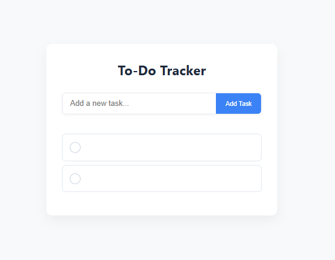
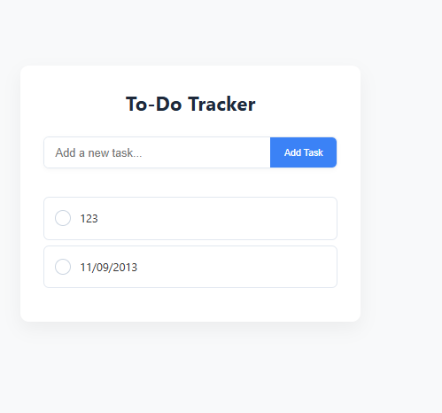

# 🐞 Bug Report Summary

## 🧾 Student Details  
**Name**: KENEDY AMBILA  
**Cohort**: JULY 2025 
**Date**: 01/10/2025

---

## ✅ Expected Behaviors  
List 3 things you expect the To-Do app to do correctly.

1. Double entry of tasks should not be allowed.  
2. Inclusion of a delete/ remove task option in cases of wrong entry or double entry.
3. Should not accept irrelevant tasks like numbers.

---

## 🐛 Reported Bugs  

### 🐞 BUG-001  
**Title**: The app accepts empty tasks 
**GitHub Link**: https://github.com/PLP-Database-Design/wk-1-KENEDY005-1/issues/1#issue-3472248227
**Requirement Affected**: Input Validation  
**Severity**: Medium 
**Summary**:  
When I intentionally enter an empty task the app displays an empty task instead of requesting me to enter a valid task. 

---

### 🐞 BUG-002 
**Title**: The app accepts invalid tasks
**GitHub Link**:  https://github.com/PLP-Database-Design/wk-1-KENEDY005-1/issues/2#issue-3472312223
**Requirement Affected**: Data validation 
**Severity**: High 
**Summary**:  
Whenever I enter an invalid task like a numeric number e.g. "123" the app adds it as a new task instead of prompting me to enter a valid task. 

---

## 💭 Reflection  

Answer briefly (1–2 paragraphs):

- What was your testing approach? Dynamic Testing  
- What did you find easy or difficult during the task?  It was easy to identify the issues. I find it hard to open using live server on my pc. "when I right click the html file and select open by live server nothing shows up. i had to go to the cloned repo and click on the html file for it to open with chrome."

It was also hard to specify which requirement is affected.
- How confident are you now in identifying and reporting bugs? Very confident

